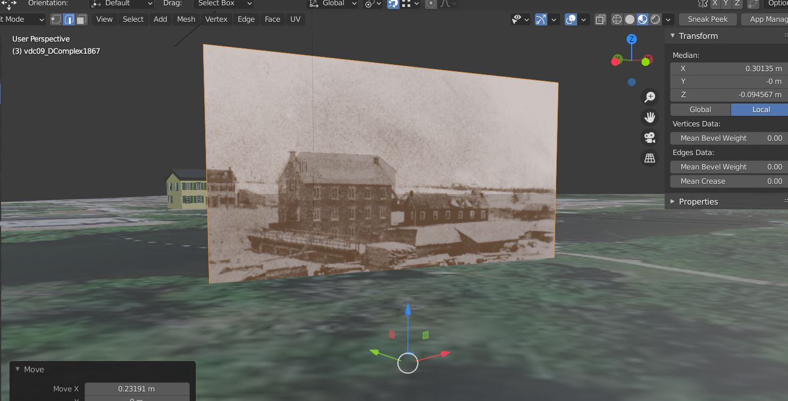

This week has had some really good successes and some frustrating moments. 

First off, what I wanted to do was play with the alignment of the photographs to the real world. In doing so, I thought to use Blender GIS, but when looking at how to import data gtom Google maps, I came across this video on how to import 3D data from google maps/google earth using RenderDoc. Everything was going smoothly, but then I had an error with getting the application to grab the data. No matter what I tried, it just would not work so I decided to scrap that idea. 
My next mode of thought was to use BlenderGIS to import 3D data. I managed to retrieve the basemap for Manotick, and then get the elevation levels only to find out that there is no 3D data for Manotick. I did a comparison with downtown Ottawa and how all the buildings there are rendered in 3D, but for Manotick it is just flat. So my solution to this was to use the project I have been working on for the Mill. I have been working on a 3D reconstruction of the site from 1860 onwards and so far I have this data.  
Using this, I imported BlenderGIS data to get the basemap of the current site to indicate where a person should stand and look when viewing the images in AR. So far I have tried out 2 images just to see what it would look like. In the next week I will have a few more images inputted.  

After aligning these photos, the next challenge was to input them in AR, which was quite the struggle. I was having a hard time figuring out how to go about getting the image in AR, until I had the bright idea to create a 3D shape like a think rectangle, and texturize it with the image of choice. I then uploaded the model to Sketchfab, but for some reason, because I am on the free version, I wasn't able to download my own model as a .gltf file, so brilliant me, I created a new Sketchfab account using my Carleton email, and then managed to download it that way with a texture file, .bin file, .txt file and a .gltf file. I then used the code provided in the AR/VR tutorial, changed the image location and the longitude and latitude locations to match that of the Mill. The success was there, but very limited. I managed to get the image to appear, but I still have to play with the alignment, rotation and size in order to match it to the real Mill. Here are a few images of what I have so far:    

So far my results have been interesting. The image is there but it glitches a little. My goal for this week is to clean it up and get the alignment correct, as well as the size and orientation. I also want to figure out how to input more than one image in one index.html file and I found something that could help, so I will be playing around more with that this week! If I can get at least 2 historic images to work, I will call that a win!

If you do find yourself at Watson's Mill in Manotick, plug in https://kavitamistry.github.io/my-project/ into firefox or chrome, I suggest not using internet explorer or safari, and stand near the Mill by the rocks out front! Hopefully it works!
