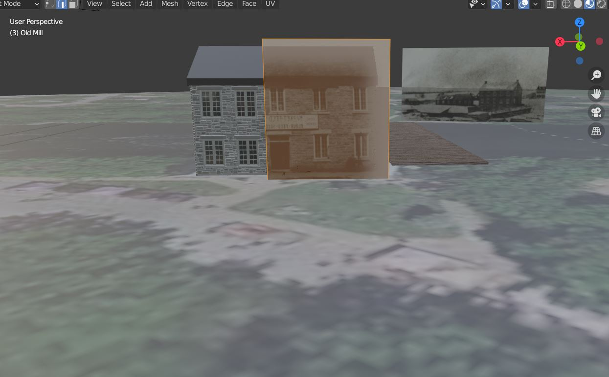
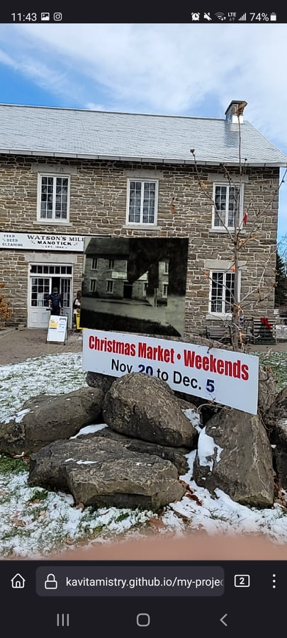
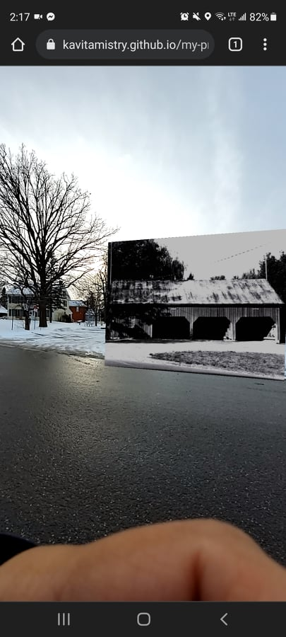

# Paradata

## The Project
The project I was working on was using aframe and location based AR to superimpose a historical image in real time. I chose the location of Watson's Mill in Manotick because I have access to quite a large collection of historical images, and it helped to be able to work on site and test the code often. I was inspired to do such a project because I love showing and telling people about historical things, and I wanted to give them a way to see history the way I see it, while also using modern technology. The purpose of this project was to compare a "then" photograph to now.  The objective is that while you are standing in front of the Mill, on your phone you have this image of what the Mill looked like almost 160 years ago. From the image on your screen and looking at where you stand now, you are able to see how things in the area have developed and changed. 

## Method
As mentioned in my Dev Log 2, I read the article [*Riverwalk: Incorporating Historical Photographs in Public Outdoor Augmented Reality Experiences*](cavallo_riverwalk_ismar_2016.pdf). The article gave me insight into what I was hoping to accomplish, and that's where my project really kicked off. My first course of action was to figure out the alignment of the historical images to the real buildings. To do this I used Blender. There is a function on Blender called BlenderGIS that allows you to import a Google Maps image with elevation data and 3D data right into Blender. I imported a section of Manotick with the main focus on Dickinson Square, and went to fetch the elevation, however that is where I ran into a few issues. Unfortunately, the map came out incredibly flat and did not produce any 3D data of the surrounding buildings. I attempted to use a program called RenderDoc, however when I followed the online instructions on how to get the 3D data, the program would give me an error saying "Failed to inject into process" and then the program would close. I decided to scratch that idea and go with what I had already with BlenderGIS. The 3D data I used is actually from something I have been working on for Watson's Mill, where I have built up a 3D recosntruction of the site in 1860 using Blender. I ended up taking my 3D reconstructions, and placing them on top of the BlenderGIS map just to give a sense of place as well a 3D representation to match the images to. From there I made 3D models, mostly just really thin rectangular prisms and texturized the shape with the historical image of the Mill. . Unfortunately when I tested the code later, the image was glitching a lot and had breaks in the image.  This forced me to revist my idea of generating a 3D model with the texture. Instead I managed to find a way to texturize a plane and use that as the model. This worked out better and I managed to fix the glitch.
Once I was able to align the images to the 3D recosntruction, I got started working with the code, but it was not super easy.

Using Dr. Graham's Basics of AR/VR tutorial, I was able to use that code and input my image. While it worked, I had to play around with the location, the rotation, and sizing to be able to align the image properly. This is what took me the longest because some days it just did not want to work for me. I managed to eventually get it to work but it really depends on the position you stand in.  My goal was to get at least two images working within the same scene but appeared separately in the frame of the camera. This is where I had a lot of troubles because when I tried adding in another image, either it would not work or it would add the image right next to the other one and would move with the other image. I wanted both images to be in separate locations that you can walk from one building to the next and see that one image appear. On the last day, it finally worked! I was able to get an image of both the Mill and the Carriage shed into one scene, and walk from one building to the other and have the images appear on my screen separately. 

This sort of AR has definitely been done before, and there are tutorials that I attempted to follow that use Javascript to input images in AR. I found the method I used easier to follow and adjust if needed. I did attempt the Javascript method, but I still am very unfamiliar with coding and got a little lost along the way. I did manage to get something working but then ran into troubles again when I tried to input another image. 

## Conclusion
This assignment for me was a way to allow the user to see the historical past through a modern lens. I have always been fascinated with historical images and seeing how things have developed in the area in however many years. This was also a way to allow the public to access some of the historical images that are kept in the Mill, in a fun and interactive way. As part of my research interests, I want to find different ways to create interactive spaces for museum visitors using modern technology. AR was definitely out of my comfort zone, but it in turn taught me an alternative approach to 3D printing objects that still offers an interactive experience that does not involve touching things, something quite frowned upon during a pandemic! 

If you find yourself near Watson's Mill in Manotick, stand across the road (where the grass is) facing the Mill and input the web link https://kavitamistry.github.io/my-project/ into CHROME or FIREFOX, accept and allow geolocation/camera settings. You should see a sepia toned image appear on your screen. Move it back and forth because sometimes the image appears larger than it is supposed to. From there, cross the road and walk over to the parking spots and stand facing the red carriage shed building. From there, another black and white image should appear. In the future, I do hope to continue working on this especially for Watson's Mill, and eventually make a tour of Manotick's historic buildings with an AR twist!
